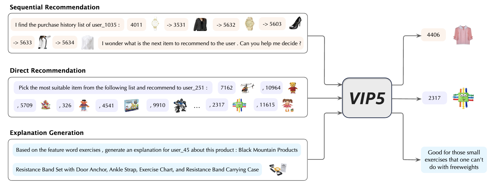

# VIP5_Shadowcast_DPA
Adaptation and Security Evaluation of Shadowcast-based Data Poisoning Attacks on the VIP5 Multimodal Recommendation System



## Dependencies: 
- PyTorch 1.12
- transformers
- tqdm
- numpy
- sentencepiece
- pyyaml
- pip install git+https://github.com/openai/CLIP.git

## Reproducibility
The project uses a default random seed of **2022** to ensure deterministic behaviour
during training and evaluation. This seed can be overridden in evaluation utilities
and data loaders via a `seed` argument if different behaviour is desired.


## Overview
VIP5_Shadowcast_DPA 是一个面向多模态推荐系统 VIP5 的数据层数据投毒攻击研究项目。本项目旨在适配和评估基于 Shadowcast 的数据投毒攻击在 VIP5 系统中的有效性与安全性。

研究主要聚焦于目标物品推广攻击（Targeted Item Promotion），探索攻击注入对推荐结果（曝光率、点击率、排名等）的影响，为后续改进防御机制提供实验依据。 

## Research Objectives

- 攻击适配与实现：
将 Shadowcast 框架中的数据投毒方法改造后用于 VIP5 多模态推荐系统，实现针对特定目标物品的直接提升攻击（Direct Boosting）、随机伴随攻击（Random Injection Attack）及热门物品模仿攻击（Popular Item Mimicking Attack）。

- 安全性评估：
分析不同数据投毒策略对系统推荐结果（曝光率、命中率、NDCG等指标）的影响，评估系统的鲁棒性和安全性。

- 实验与分析：
设计实验流程，对攻击效果进行数据统计、可视化和深入分析，形成研究论文和实验报告。


## Project Structure


```plaintext
VIP5_Shadowcast_DPA/
├── analysis/                     # 分析脚本及结果存放目录
│   ├── analyze_popularity.py    # 物品流行度分析脚本
│   └── results/                 # 分析结果（文本、图形）按分类存放
├── src/                         # 源代码目录，包含训练、数据加载、攻击注入等模块
│   ├── data.py                  # 数据加载及预处理模块
│   ├── model.py                 # 模型架构与训练相关代码
│   ├── param.py                 # 参数设置及配置文件
│   ├── trainer_base.py          # 训练基础模块
│   └── ...                      # 其他相关模块
├── notebooks/                   # Jupyter Notebook 文件，交互式实验与数据探索
├── scripts/                     # Shell 脚本目录，用于启动训练或评估实验
│   ├── train_VIP5.sh            # 训练脚本示例
│   └── ...                      # 其他脚本文件
├── DPA_cmd.txt                  # 攻击命令及参数说明
├── Project_start_date.txt       # 项目启动日期记录
├── LICENSE                      # 许可协议文件
├── README.md                    # 本文件
├── requirements.txt             # Python 依赖列表
└── (其他目录和文件被 .gitignore 忽略，如 data/, snap/, features/, photos/, log/, transformers/ 等)
```


注意：
为了保持仓库轻量，本仓库不会上传以下内容：

    大型数据集（data/ 目录）

    模型权重和训练检查点（snap/ 目录）

    特征提取文件（features/ 目录）

    图片资源（photos/ 目录）

    日志和运行输出（log/ 目录）

    第三方依赖（transformers/ 目录）

所有这些内容均在 .gitignore 中被排除，数据和图片请参考项目说明，加载时可从外部存储（如 Google Drive ）获取。

Download preprocessed data and image features from this [Google Drive link](https://drive.google.com/drive/u/1/folders/1AjM8Gx4A3xo8seYFWwNUBHpM9uRbfydR), then unzip them into the *data* and *features* folders


## Setup and Installation
1. 克隆仓库（仅包含代码及必要文件）:
    ```
    git clone https://github.com/GuoweiGuan666/VIP5_Shadowcast_DPA.git
    cd VIP5_Shadowcast_DPA

    ```

2. 创建虚拟环境并安装依赖:
   以 vip5_env 为例：
    ```
    python -m venv vip5_env
    source vip5_env/bin/activate   # Linux/MacOS
    # Windows: vip5_env\Scripts\activate
    pip install -r requirements.txt

    ```

3. 数据说明:
   本项目中数据集部分（经过预处理的大数据、图片、特征等）未上传，数据加载模块 [src/data.py] 中包含如何加载数据的说明。
   请参阅项目说明文档以获取数据下载和预处理指南。


## Environment Info

- OS: Ubuntu 20.04
- Python: 3.9
- Virtual Env: vip5_env
- GPU: A100 (CUDA 11.7)
- Core Libs:
  - torch==1.13.1+cu117
  - transformers==4.36.2
  - datasets==2.14.5
  - scikit-learn==1.3.2
  - Pillow==9.4.0
  - tqdm==4.65.0


## Usage

- 训练模型：
  在 scripts/train_VIP5.sh 中包含了训练命令模板，运行脚本即可启动训练：
  ```
  bash scripts/train_VIP5.sh
  ```
训练过程中将注入特定的攻击策略，详情请参阅 DPA_cmd.txt 文件说明。

- 评估与分析：
  查看 notebooks/ 目录中的 Notebook 文件，内有数据分析、攻击效果评估及结果可视化示例。

- 参数设置：
  关键参数在 src/param.py 中设置，可根据实验需求修改。

## Current Status and Future Work
- 当前进展：

    攻击注入模块已经完成，支持多种数据投毒攻击策略。

    参数化配置和训练、验证流程已初步打通。

    正在进行 Direct Boosting 攻击的调试和目标项定位，以及训练日志分析。

- 后续工作：

    进一步完善各类攻击策略（如 Random Injection 和 Popular Item Mimicking）。

    扩展系统在 explanation、sequential 等任务中的对抗性评估。

    优化算法和防御机制，提升模型鲁棒性。


## Contributing

如果你想参与本项目的开发或提供建议，请参考 CONTRIBUTING.md 中的指南。

## License

本项目采用 MIT License。

## Contact

    Author: Guowei Guan

    Email: 

    Affiliation: NTU


## From previous work， for reference only

## Usage

1. Clone this repo

2. Download preprocessed data and image features from this [Google Drive link](https://drive.google.com/drive/u/1/folders/1AjM8Gx4A3xo8seYFWwNUBHpM9uRbfydR), then unzip them into the *data* and *features* folders

   
3. Create *snap* and *log* folders to store VIP5 checkpoints and training logs:
    ```
    mkdir snap log
    ```

4. Conduct parameter-efficient tuning with scripts in *scripts* folder, such as

    ```
    CUDA_VISIBLE_DEVICES=0,1,2,3 bash scripts/train_VIP5.sh 4 toys 13579 vitb32 2 8 20
    ```


## DCIP-IEOS attack pipeline

The lightweight `attack/ours/dcip_ieos/run_dcip_ieos.py` script orchestrates the
toy DCIP‑IEOS poisoning pipeline used in the tests. By default it aborts when
the competition pool contains entries without image or text features. The
`--skip-missing` flag allows the script to continue by skipping such targets:

```bash
python attack/ours/dcip_ieos/run_dcip_ieos.py --dataset <split> --skip-missing
```

Each skipped item is logged with a warning while the remaining targets are
processed as normal.

## Citation

Please cite the following paper corresponding to the repository:
```

```

## Acknowledgements

[P5](https://github.com/jeykigung/P5), [VL-T5](https://github.com/j-min/VL-T5), [PETER](https://github.com/lileipisces/PETER), and [S3-Rec](https://github.com/aHuiWang/CIKM2020-S3Rec)


